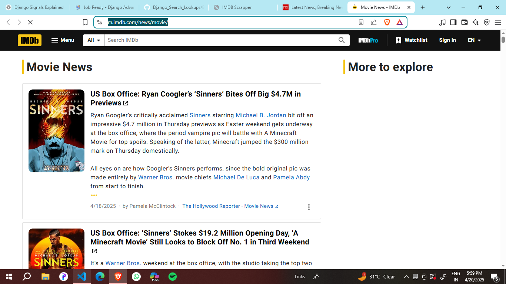
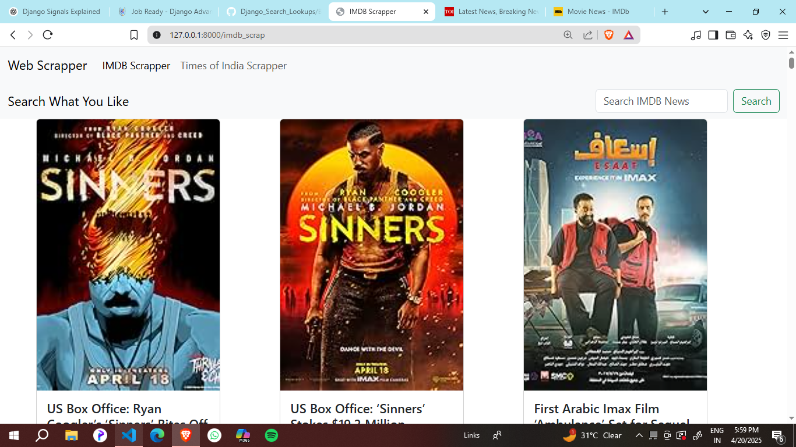
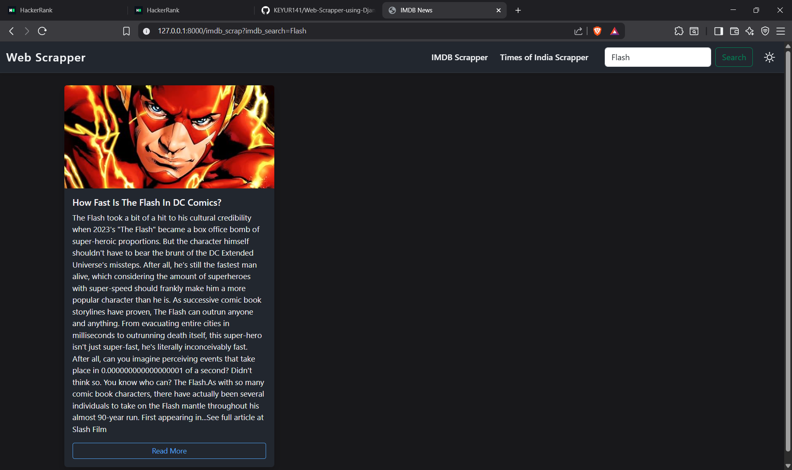
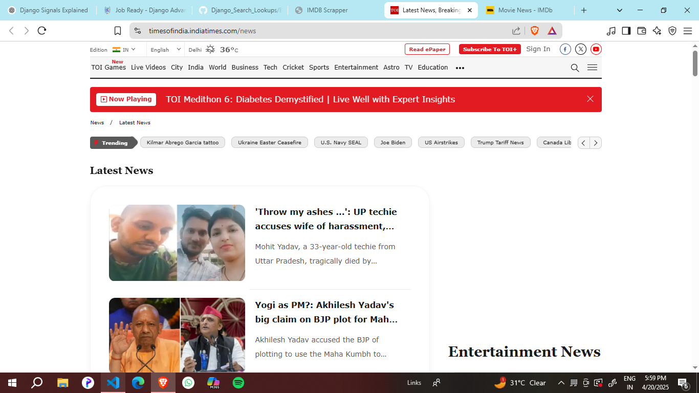
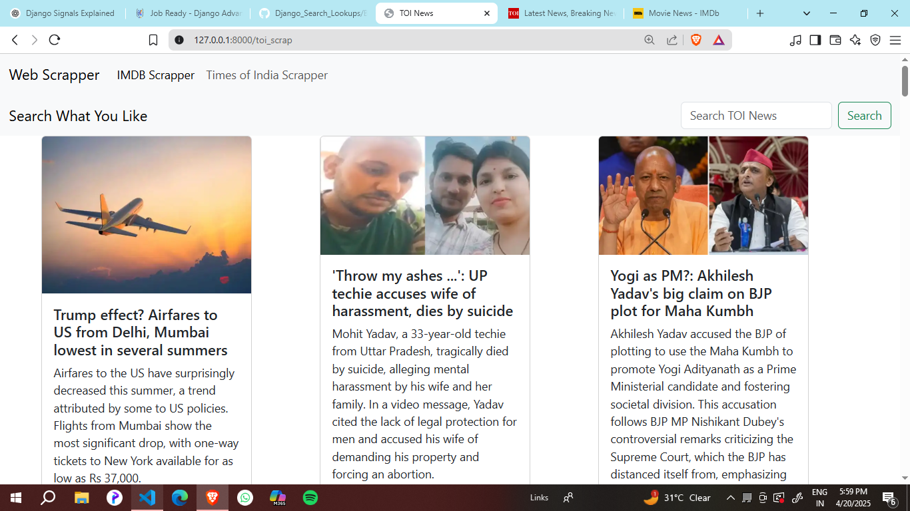
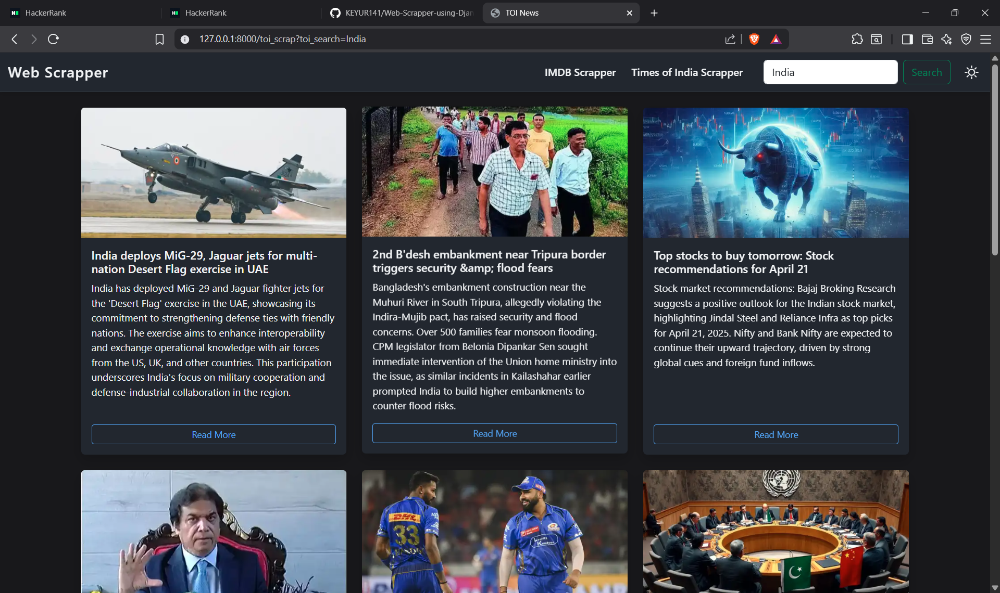

# Web-Scrapper-using-Django

<div class="Intro">
  <h2>1.Introduction</h2>
  <p>
  This project is a 💻 <strong>Django-powered web application</strong> built for practicing and demonstrating 
  <strong>web scraping</strong> skills. It scrapes data from two major sources — 🎬 <strong>IMDb</strong> 
  for top movie listings and 📰 <strong>Times of India (TOI)</strong> for the latest news articles. Using libraries 
  like <code>requests</code> and <code>BeautifulSoup</code>, the data is fetched, processed, and displayed on a 
  responsive Bootstrap-powered frontend. The project features simple navigation, live search functionality, and 
  dynamic rendering of images, titles, and external links — all managed through Django views and models.
</p>
<h2>🚀 Features</h2>
<ul>
  <li>Scrapes <strong>top movies</strong> from IMDb 🎥</li>
  <li>Scrapes <strong>latest news articles</strong> from Times of India 🗞️</li>
  <li>Displays data dynamically using Django models and templates</li>
  <li>Search functionality for quickly finding movies or news</li>
  <li>Responsive Bootstrap-based UI</li>
</ul>
  <h2>🛠️ Tools Used</h2>


  
</div>

<div class="Second Step">
  <h2>🧠 Step 2: Code Explanation - Web Scraping Functions</h2>

<h3>🎬 <code>scrape_imdb_news()</code> - Scraping IMDb News</h3>
<ul>
  <li>📡 Sends a GET request to <code>https://m.imdb.com/news/movie/</code> using a custom <code>User-Agent</code> header for compatibility.</li>
  <li>🧼 Parses the HTML response using <strong>BeautifulSoup</strong> with the <code>html.parser</code>.</li>
  <li>🔍 Extracts news cards by locating all <code>&lt;div&gt;</code> tags with class <code>ipc-list-card--border-line</code>.</li>
  <li>For each news item:
    <ul>
      <li>📝 <strong>Title</strong> is fetched from an <code>&lt;a&gt;</code> tag and cleaned using <code>.text.strip()</code>.</li>
      <li>📰 <strong>Description</strong> is extracted from a <code>&lt;div&gt;</code> with class <code>ipc-html-content-inner-div</code>.</li>
      <li>🖼️ <strong>Image</strong> URL is fetched from the <code>src</code> attribute of the <code>&lt;img&gt;</code> tag.</li>
      <li>🔗 <strong>External Link</strong> is pulled from the <code>href</code> of the anchor tag.</li>
    </ul>
  </li>
  <li>💾 The extracted data is saved in the database using <code>IMBD_News.objects.create(**news)</code>.</li>
</ul>

<pre><code>def scrape_imdb_news():
    url = 'https://m.imdb.com/news/movie/'
    headers = { 
        'User-Agent': "Mozilla/5.0 (Windows NT 10.0; Win64; x64)"
    }
    response = requests.get(url, headers=headers)
    soup = BeautifulSoup(response.text, 'html.parser')
    news_items = soup.find_all('div', class_='ipc-list-card--border-line')
    
    for item in news_items:
        title = item.find('a', class_="ipc-link ipc-link--base sc-dd244256-2 gbQCSG")
        description = item.find('div', class_="ipc-html-content-inner-div")
        image = item.find('img', class_="ipc-image")
        external_link = title['href'] if title else "No external link"
        
        title = title.text.strip() if title else "No Title"
        description = description.text.strip() if title else "No Description"
        image = image['src']
        
        news = {
            'title': title,
            'description': description,
            'image': image,
            'external_link': external_link
        }
        IMBD_News.objects.create(**news)
</code></pre>

<h3>🗞️ <code>scrape_toi_news()</code> - Scraping Times of India News</h3>
<ul>
  <li>🌐 Sends a GET request to <code>https://timesofindia.indiatimes.com/news</code>.</li>
  <li>🧼 Uses BeautifulSoup to parse the HTML content.</li>
  <li>🔎 Finds all <code>&lt;li&gt;</code> items (containers for each news item).</li>
  <li>For each news item:
    <ul>
      <li>📝 <strong>Title</strong> from <code>&lt;p class="CRKrj"&gt;</code></li>
      <li>📰 <strong>Description</strong> from <code>&lt;p class="W4Hjm"&gt;</code></li>
      <li>🖼️ <strong>Image</strong> from <code>src</code> or <code>data-src</code> of <code>&lt;img&gt;</code></li>
      <li>🔗 <strong>External Link</strong> from <code>&lt;a href="..."&gt;</code></li>
    </ul>
  </li>
  <li>🔁 Converts relative image URLs to absolute using TOI's domain prefix if necessary.</li>
  <li>🚫 Skips duplicate entries by checking if the title already exists.</li>
  <li>💾 Saves data using <code>TOI_News.objects.create(**news)</code>.</li>
</ul>

<pre><code>def scrape_toi_news():
    url = "https://timesofindia.indiatimes.com/news"
    headers = { 
        'User-Agent': "Mozilla/5.0 (Windows NT 10.0; Win64; x64)"
    }
    response = requests.get(url, headers=headers)
    soup = BeautifulSoup(response.text, 'html.parser')
    news_items = soup.find_all('li')
    
    for item in news_items:
        title_tag = item.find('p', class_="CRKrj")
        description_tag = item.find('p', class_="W4Hjm")
        image_tag = item.find('img')
        link_tag = item.find('a', href=True)

        if not (link_tag and title_tag and description_tag and image_tag):
            continue

        title = title_tag.text.strip() if title_tag else "No Title"
        description = description_tag.text.strip() if description_tag else "No Description"
        external_link = link_tag['href'].strip()
        image = None
        if image_tag:
            if image_tag.has_attr('data-src'):
                image = image_tag['data-src']
            elif image_tag.has_attr('src'):
                image = image_tag['src']
            if image and image.startswith("/"):
                image = "https://static.toiimg.com" + image

        if TOI_News.objects.filter(title=title).exists():
            print("Duplicate found. Skipping:", title)
            continue

        news = {
            'title': title,
            'description': description,
            'image': image,
            'external_link': external_link        
        }
        TOI_News.objects.create(**news)
</code></pre>

</div>


<div class="third step">
  <h2>⚙️ Step 3: Django Views Explained</h2>

<p>In this step, Django views are used to connect the backend scraping logic with the frontend templates. Views manage both user-triggered scraping and data display from the database.</p>

<h3>🎬 <code>imdb_run_scrapper(request)</code></h3>
<ul>
  <li>🔁 Calls the <code>scrape_imdb_news()</code> function to fetch and save latest IMDb news articles.</li>
  <li>✅ Returns a <code>JsonResponse</code> to confirm successful execution with a message.</li>
</ul>

<pre><code>def imdb_run_scrapper(request):
    scrape_imdb_news()
    return JsonResponse({
        "status": True,
        "Message": "IMDB Scrapper Executed"
    })
</code></pre>

<h3>🖼️ <code>imdb_index(request)</code></h3>
<ul>
  <li>🗃️ Retrieves all IMDb news records from the database using <code>IMBD_News.objects.all()</code>.</li>
  <li>🔍 If a search query (<code>imdb_search</code>) is provided via GET request, filters news based on keywords in title or description using <code>Q()</code> lookups.</li>
  <li>🖥️ Renders the results to the <code>IMDBindex.html</code> template.</li>
</ul>

<pre><code>def imdb_index(request):
    data = IMBD_News.objects.all()
    search = request.GET.get('imdb_search')

    if search:
        data = data.filter(
            Q(title__icontains=search) |
            Q(description__icontains=search)
        )

    return render(request, "IMDBindex.html", context={
        'data': data,
        'toi_search': search
    })
</code></pre>

<h3>🗞️ <code>toi_run_scrapper(request)</code></h3>
<ul>
  <li>🔁 Triggers <code>scrape_toi_news()</code> function to fetch the latest TOI news.</li>
  <li>✅ Returns a <code>JsonResponse</code> confirming that the scraper executed successfully.</li>
</ul>

<pre><code>def toi_run_scrapper(request):
    scrape_toi_news()
    return JsonResponse({
        "status": True,
        "Message": "Times of India Scrapper Executed"
    })
</code></pre>

<h3>📰 <code>toi_index(request)</code></h3>
<ul>
  <li>🗃️ Retrieves all TOI news records from the <code>TOI_News</code> model.</li>
  <li>🔍 Applies filters based on search query (<code>toi_search</code>) to match relevant titles or descriptions.</li>
  <li>🖥️ Renders the data in the <code>TOIindex.html</code> template.</li>
</ul>

<pre><code>def toi_index(request):
    data = TOI_News.objects.all()
    search = request.GET.get('toi_search')

    if search:
        data = data.filter(
            Q(title__icontains=search) |
            Q(description__icontains=search)
        )

    return render(request, "TOIindex.html", context={
        'data': data,
        'toi_search': search
    })
</code></pre>

<h3>🌐 <code>Main_Page(request)</code></h3>
<ul>
  <li>📃 Simply renders the main landing page (<code>NavBar.html</code>), which likely includes links to both IMDb and TOI sections.</li>
</ul>

<pre><code>def Main_Page(request):
    return render(request, 'NavBar.html')
</code></pre>

</div>

<div class="Fourth Step">
<h2>🎨 Step 4: Frontend Templates (UI) Explained</h2>
<p>This project uses Django’s template inheritance with Bootstrap for a clean, responsive UI. Below are the three main templates:</p>

<h3>🧩 <code>Navbar.html</code> (Base Template)</h3>
<ul>
  <li>Acts as the master layout extended by all pages</li>
  <li>Includes the site-wide navbar with links to IMDb and TOI sections</li>
  <li>Loads Bootstrap via CDN</li>
  <li>Defines two blocks: <code></code> and <code></code></li>
</ul>

```html
<!doctype html>
<html lang="en">
<head>
  <meta charset="utf-8">
  <title>Web Scraper</title>
  <link href="https://cdn.jsdelivr.net/npm/bootstrap@5.3.5/dist/css/bootstrap.min.css" rel="stylesheet">
</head>
<body>
  <nav class="navbar navbar-expand-lg bg-body-tertiary">
    <div class="container-fluid">
      <a class="navbar-brand" href="#">Web Scraper</a>
      <div class="collapse navbar-collapse" id="navbarNav">
        <ul class="navbar-nav">
          <li class="nav-item">
            <a class="nav-link" href="">IMDB Scraper</a>
          </li>
          <li class="nav-item">
            <a class="nav-link" href="">TOI Scraper</a>
          </li>
        </ul>
      </div>
    </div>
  </nav>

  <div class="container mt-4">
    
  </div>
</body>
</html>
```

<h3>🎬 <code>IMDBindex.html</code> (IMDb Template)</h3>
<ul>
  <li>Extends <code>Navbar.html</code></li>
  <li>Provides a search form for IMDb news (<code>imdb_search</code>)</li>
  <li>Loops over <code>data</code> and displays each news item as a Bootstrap card</li>
</ul>

```html

IMDB Scraper


<nav class="navbar bg-body-tertiary mb-3">
  <form class="d-flex" method="get">
    
    <input class="form-control me-2" type="search" name="imdb_search" placeholder="Search IMDb News">
    <button class="btn btn-outline-success" type="submit">Search</button>
  </form>
</nav>

<div class="row">
  
  <div class="col-md-4 mb-4">
    <div class="card h-100">
      
      <div class="card-body">
        <h5 class="card-title">{{ news.title }}</h5>
        <p class="card-text">{{ news.description }}</p>
      </div>
      <div class="card-footer">
        <a href="{{ news.external_link }}" class="btn btn-primary" target="_blank">Read More</a>
      </div>
    </div>
  </div>
  
</div>

```

<h3>📰 <code>TOIindex.html</code> (Times of India Template)</h3>
<ul>
  <li>Extends <code>Navbar.html</code></li>
  <li>Provides a search form for TOI news (<code>toi_search</code>)</li>
  <li>Loops over <code>data</code> and displays each news item as a Bootstrap card</li>
</ul>

```html

TOI News


<nav class="navbar bg-body-tertiary mb-3">
  <form class="d-flex" method="get">
    
    <input class="form-control me-2" type="search" name="toi_search" placeholder="Search TOI News">
    <button class="btn btn-outline-success" type="submit">Search</button>
  </form>
</nav>

<div class="row">
  
  <div class="col-md-4 mb-4">
    <div class="card h-100">
      
      <div class="card-body">
        <h5 class="card-title">{{ news.title }}</h5>
        <p class="card-text">{{ news.description }}</p>
      </div>
      <div class="card-footer">
        <a href="{{ news.external_link }}" class="btn btn-primary" target="_blank">Read More</a>
      </div>
    </div>
  </div>
  
</div>

```

</div>

<div class="Fifth Step">
  <h2>Images of the Outputs and Old Web Scrapped Pages </h2>
  
  <p>5.1 IMDB original Webpage</p>
  
  <p>5.2 IMDB Web Scrapper Page</p>
  
  <p>5.3 Searching in IMDB Page</p>
  <br><br>
  
  <p>5.4 TOI original Webpage</p>
  
  <p>5.5 TOI Web Scrapper Page</p>
  
  <p>5.6 Searching in TOI Page</p>
  
</div>

<div class="Sixth Step">
  <h2>6.✅ Conclusion</h2>

<p>
  This Django-based web scraping project was built to aggregate and present the latest <strong>entertainment news from IMDb</strong> 🎬 and <strong>general news from Times of India</strong> 📰 in a user-friendly, searchable interface.
</p>

<p>
  By combining <code>BeautifulSoup</code> for scraping, Django’s ORM for data storage, and Bootstrap for styling, I was able to deliver a clean and functional web application that keeps users updated with fresh headlines. 🔁✨
</p>

<p>
  Key Features:
  <ul>
    <li>🔍 Keyword-based search to filter news titles and descriptions</li>
    <li>🖼️ Responsive card layouts displaying images, summaries, and external links</li>
    <li>🧠 Optimized with Django’s MVC pattern and reusable templates</li>
  </ul>
</p>

<p>
  This project helped me strengthen my Django fundamentals, learn the importance of data parsing and filtering, and experiment with real-time web data collection. 🚀
</p>

<p>
  Thank you for checking it out! 😊<br>
  Feel free to clone, star ⭐, or fork 🍴 this project if you found it helpful. Contributions and feedback are always welcome! 🙌
</p>

</div>
